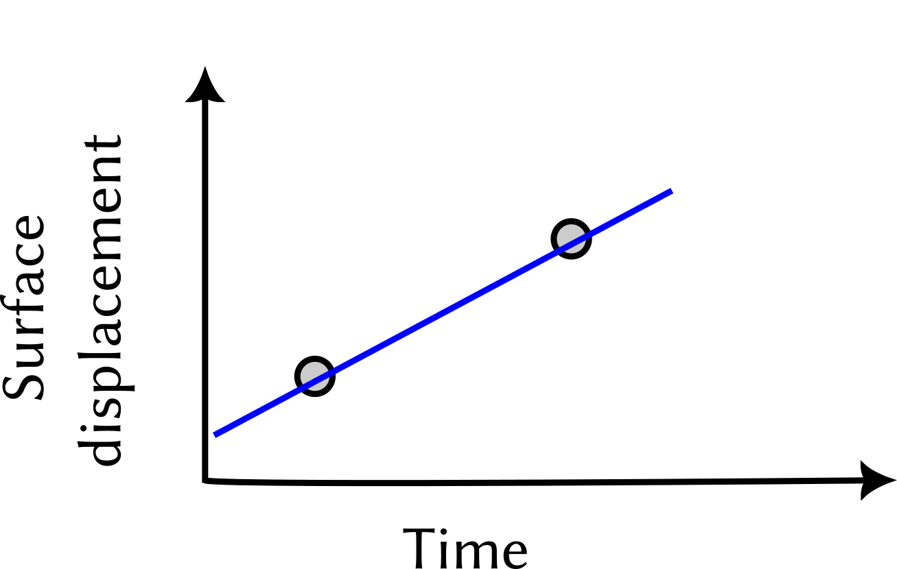
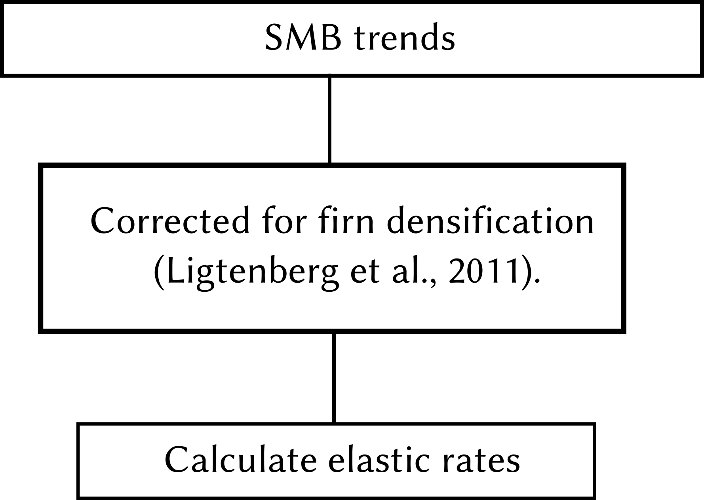
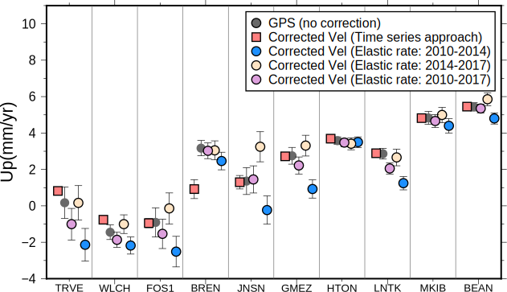
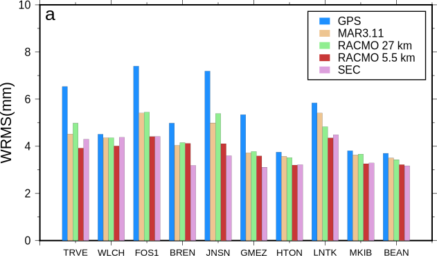

<!--
-------------------------------------------------------------------------------
This file defines the contents of each slide.
The reveal.js configuration can be found in index.html
-------------------------------------------------------------------------------
-->

<!-- .slide: class="slide-title" data-background-color="#000000" data-background-image="assets/title-slide.svg" data-background-repeat="no-repeat" data-background-opacity="0.3" data-background-position="center" -->

<!-- Place the content at the bottom of the slide -->

<h1 id="talk-title">
  Elastic deformation due to Surface Mass Balance Variability in the Southern Antarctic Peninsula
</h1>

  Achraf Koulali,
  Pippa L. Whitehouse, Peter J. Clarke, Michiel R. van den Broeke, Grace A. Nield, Matt A. King, Michael J. Bentley, Bert Wouters, and Terry Wilson

SCAR-PSE workshop Sept 29 – Oct 1, 2022

<!-- Place location and date side-by-side with affiliation logos -->
<!-- 

<!-- Permission to reuse and CC-BY license logo -->
<a href="https://creativecommons.org/licenses/by/4.0/"><i class="fab fa-creative-commons"></i><i class="fab fa-creative-commons-by" style="margin: 0 10px 0 2px"></i> CC-BY 4.0 License</a>

<!-- Add logos here. Need these wrappers to align them to the bottom right -->

  

===============================================================================

[Full publication link](https://agupubs.onlinelibrary.wiley.com/doi/10.1029/2021GL097109)

===============================================================================

# Vertical Land motion (VLM): Antarctica

## Why do we need to know it?

- Impacts of sea level rise are driven by relative motion of the sea with respect to land.

- GNSS data constrain vertical VLM near cost and inland. 

- Solid Earth VLM shows highly variable spatial and temporal scales.  

- Diversity of processes contributing to VLM.

===============================================================================

# Vertical Land motion (VLM): Antarctica

Whitehouse et al. (2019) 

King and Santamaría-Gómez (2016)

Nield et al. (2014)

===============================================================================

# GNSS observations of VLM: Antarctica

Continuous GPS sites from UNAVCO's archive.

- Better power solutions at the majority of sites;

- Instruments transmitting data in real time, direct to UNAVCO;

- Servicing requirements monitored remotely.

===============================================================================

# GNSS observations of VLM: Antarctica / UKANET

UKANET-GNSS network status

 

 

- All sites have been collecting data for at least 3 years, some for >10 years

- Percentage data return varies between <20% and close to 100%

===============================================================================

# GNSS observations of VLM: Vertical time series

- Time series reveal dominant trends, with variability.

- The estimation of GPS velocities that reflect **long-term displacement** require applying corrections for **elastic deformation of the solid Earth** 

- Can we explain the VLM signal using **contemporaneous surface loading** changes ?

===============================================================================

# Surface Mass Balance: Spatio-temporal variability

- The 2016 three-monthly mean of the SMB anomalies from RACMO2.3, over the Southern Antarctic Peninsula, shows a very pronounced variation.;

- The anomalies exhibit an east-west pattern.

===============================================================================

# Contemporaneous surface loading: elastic deformation of the solid Earth 

We consider deformation due to annual and interannual fluctuations of SMB  to be purely elastic in this region.

- Regional ElAstic Rebound calculator REAR (Melini et al., 2015). 

- We adopted the Preliminary Reference Earth Model (PREM; Dziewonski & Anderson, 1981).

===============================================================================

# Contemporaneous surface loading: elastic deformation of the solid Earth 

===============================================================================

# GPS data and Elastic corrections

We investigate two approaches for the calculation of the elastic deformation signal:

1 - Time Series Approach:

2 - "Linear Rates Approach":

→ This approach assumes SMB loading trend is constant in time.

===============================================================================

# GPS data and Elastic corrections

1 - Time Series Approach:
 

2 - "Linear Rates Approach":
 

For our study, we consider 3 periods: <mark>2010-2014 / 2014-2017 & 2010-2017</mark>

===============================================================================

# SMB Elastic correction: "Linear rate" vs "Time series"

- Corrected velocities over 2010–2014 differ from those of 2014–2017 or 20102017.

- This is a result of the large magnitude, time-dependent nature of surface mass change.

===============================================================================

# SMB Elastic correction time series (model resolution)

- We observe a WRMS reduction after correcting for SMB effects compared with the raw time series.

- The highest reduction in the WRMS occurs for the RACMO2.3 high resolution (5.5 km) model [See also Martín-Español et al. (2016)].

===============================================================================

# Implication for Vertical Land Motion Rates

- GPS estimates of bedrock velocities have become widely used for testing/informing the different GIA model predictions.

- We compare four model predictions of present-day GIA-related uplift rates and the estimated GPS rates after correction using the time series approach.

===============================================================================

# Implication for Vertical Land Motion Rates

   
Although all models reproduce well the overall pattern of deformation at most sites, disagreements are seen in different sites;

The solution of Gunter2014 is the closest to the GPS observations, with a WRMS of 0.95 mm/yr;

===============================================================================

# Conclusions

- We have modeled short-term variations in surface deformation using a purely elastic model.

- Given that GPS time series include a range of transient non-linear signals, their interpretation by simply fitting standard linear trajectory models is prone to biases.

- We have shown in this study, the background linear rate derived from GPS time series depends on how well we can model the present-day elastic deformation, hence caution should be applied when tuning GIA models using observations that contain multiple signals.

===============================================================================

<!-- .slide: class="slide-license" -->

<i class="fab fa-creative-commons"></i><i class="fab fa-creative-commons-by"></i>

Unless otherwise noted,
the contents of this presentation are
licensed under the
 
[Creative Commons Attribution 4.0 International License](https://creativecommons.org/licenses/by/4.0/).
